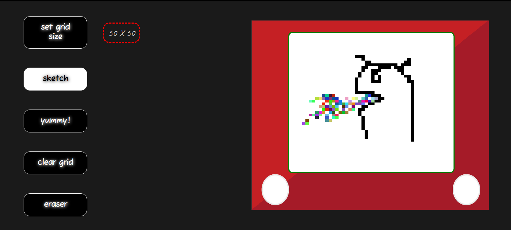

# Etch-a-Sketch

A web application to simulate the **Etch-a-Sketch** toy using basic HTML, CSS and JavaScript.

### What's Etch-a-Sketch?

It is a mechanical drawing toy named as one of the most popular and creative toys created, and is a staple piece of childhood memory for many. It has two knobs below its screen which gives horizontal and vertical control of the stylus behind the screen to create a drawing. The application developed here simulates this toy on a browser using the mouse as our stylus.

**Check it out :point_right:[here](https://mell62.github.io/etch-a-sketch/):point_left:!**

## :star2: Features

Basic working: Click and drag your mouse over the white screen of the Etch-a-Sketch

- Set grid size: Grid sizes ranging from 1 to 60 for more detailed sketching
- Sketch: Basic black colored sketching
- Yummy!: Colorful sketching
- Clear grid: Clear the entire screen
- Eraser: An in-built eraser tool to erase parts of choice in the sketch
